<h1 align="center">
    yorumi - deep code, quiet sea
</h1>

Yorumi is a color scheme inspired by the calming night sea, that washes your editor in a soothing blend of blues and greens, enhancing focus and readability for productive late-night coding sessions. Think cozy vibes and muted tones – a stark contrast to the harsh glare of traditional themes.

I've been a loyal user of the [Kanagawa](https://github.com/rebelot/kanagawa.nvim) theme by [rebelot](https://github.com/rebelot) on GitHub. Yorumi takes things a step further, offering a darker and cozier aesthetic for a truly focused coding experience.

## What you'll find here

* **Palette Deep Dive:** There's a detailed breakdowns of each color group, including color codes, and explanations of their role within the scheme.
* **See it in Action:** Charts, color swatches, and maybe even some code snippets showcasing Yorumi in all its glory.
* **Download the Goodness:** Ready to ditch the eye strain? Download Yorumi theme files for your favorite developer tools and applications. Here's to your cozier digital home <3

* **Yorumi Website:** https://yorumicolors.cc - Explore the Yorumi website for a comprehensive overview.
* **Contributing:** Feeling generous (or just love Yorumi)? Check out the CONTRIBUTING.md file for details on contributing to the project.

Yorumi is here to transform your coding into a peaceful and focused journey. Dive in, explore the palette, and see if it fits your coding style!

## Palette

Yorumi comes as a collection of 24 colors. All the essential 8 colors come in 3 variants:
* Dark (D)
* Normal (N)
* Light (L)

I would prescribe using D and N palettes in light themes and N and L palettes in darker themes. Here's a quick overview of the color groups and their roles within the scheme:

### Yoru ( 夜 ) - Night

Encompassing the profound blacks of the ocean's abyss, these shades form the backbone of light themes, offering depth and focus where it's needed most. They're meant to act as backgrounds
in darker themes and foregrounds in lighter themes.

| Color                            | Name           | Reference | Description                                                                                                            |
|----------------------------------|----------------|-----------|------------------------------------------------------------------------------------------------------------------------|
| 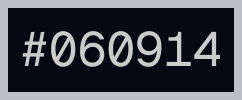 | Abyss Black    | `d-black` | The abyssal sea, the darkest color in the palette, used for backgrounds and text.                                      |
| 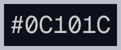 | Midnight Sea   | `n-black` | A slightly lighter black, used for text and secondary UI elements.                                                     |
| 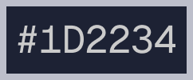 | Night Ripple   | `l-black` | The lightest black, akin to the reflective surface of the sea under moonlight, ideal for subtle contrasts and accents. |

### Tsukiakari ( 月明かり ) - Moonlight 

Illuminating with the pure, serene whites of moonlight, these hues are designed for clarity and contrast in dark themes. Again, they're meant to act as backgrounds in lighter themes and
foregrounds in darker themes.

| Color                            | Name             | Reference | Description                                                                                                            |
|----------------------------------|------------------|-----------|------------------------------------------------------------------------------------------------------------------------|
| 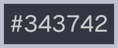 | Crescent Shadow  | `d-white` | Evokes the subtle illumination of a moonlit night. Perfect for backgrounds of inactive UI elements.                    |
| 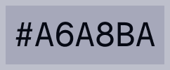 | Lunar Silver     | `n-white` | A neutral white offering clarity without an overpowering brightness. Ideal for secondary textual elements.             |
| 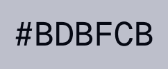 | Moonbeam White   | `l-white` | The brightest white, capturing the full moon's radiance, suitable for highlights and active foreground text.           |

### Umi ( 海 ) - Sea

These are the vital D-colors, reminiscent of the sea's vast expanse; they are intended to be used in tandum with the Sango colors in lighter themes.

| Color                             | Name             | Reference   | Description                                                                                                            |
|---------------------------------- |------------------|-----------  |------------------------------------------------------------------------------------------------------------------------|
| 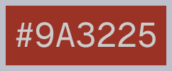    | Deep Coral       | `d-red`     | The darkest red from the corals. Ideal for impactful error accents.                                                    |
| 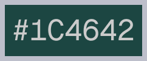  | Kelp Forest      | `d-green`   | Dark green akin to the dense sea kelp, perfect for grounding elements, and impactful success accents.                  |
| 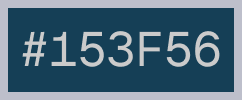   | Heart of the Sea | `d-blue`    | Dark crystalline blue. Ideal for accented elements, including headers.                                                 |
| 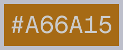 | Submarine Gold   | `d-yellow`  | A rich, dark gold, reminiscent of treasures hidden in the sea's abyss, for icons and key interactions.                 |
| 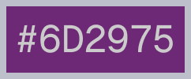| Muave            | `d-magenta` | A dark magenta as seen in the mystical sea life, ideal for accents that command attention.                             |
| 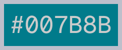   | Maritime Teal    | `d-cyan`    | Teal like the deep coastal waters, great for emphasis without overpowering.                                            |

### Sango ( 珊瑚 ) - Corals

The N-colors draw from the dynamic and colorful coral reefs, providing spirited vibrancy in both light and dark themes. They're meant to be used with D-Colors (Umi) in lighter themes
and with L-Colors (Shio) in darker themes. These are the most vibrant versions.

| Color                              | Name          | Reference   | Description                                                                                                             |
|------------------------------------|---------------|-------------|-------------------------------------------------------------------------------------------------------------------------|
| 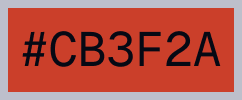     | Reef Spark    | `n-red`     | The true coral red, vibrant yet not overwhelming, for errors, warnings, and critical UI elements.                       |
| 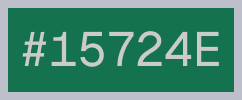   | Marine Bloom  | `n-green`   | The core green, rich and full of life, like the underwater world, for strings, comments, and success messages.          |
| 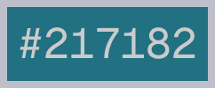    | Lagoon        | `n-blue`    | The serene blue of a calm lagoon, versatile for links and interactive elements.                                         |
| 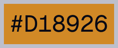  | Sand Dollar   | `n-yellow`  | A true, sunny yellow, idea for highlights and warnings.                                                                 |
| 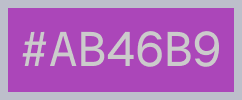 | Coral Pink    | `n-magenta` | Soft yet vibrant, like the varied colors of coral, perfect for creative accents.                                        |
| 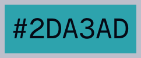    | Shoreline     | `n-cyan`    | Closer to the shore, a choice for interactive elements and informational alerts.                                        |

### Shio (潮) - Tide

Representing the L-colors, these tones capture the soft, diffused light of the shoreline, perfect for foregrounds in dark settings.

| Color                             | Name             | Reference   | Description                                                                                                            |
|---------------------------------- |------------------|-----------  |------------------------------------------------------------------------------------------------------------------------|
| 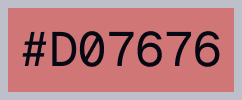    | Tidal Blush      | `l-red`     | A soft red, reminiscent of the sky's reflection on the water at low tide, for buttons and icons.                       |
| 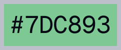  | Kelp Forest      | `l-green`   | The light green of shallow waters as the tide recedes, great for positive actions.                                     |
| 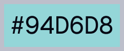   | Heart of the Sea | `l-blue`    | The soft blue of seafoam along the shore, ideal for information panels and selection foregrounds.                      |
| 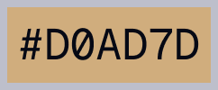 | Submarine Gold   | `l-yellow`  | The welcoming yellow of a sunrise over a sandy beach, perfect for soft warnings and highlighted information.           |
| 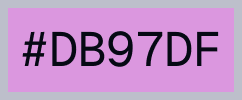| Muave            | `l-magenta` | A muted magenta that evokes the delicate colors of tidal flowers, suited for subtle notifications and accents.         |
| 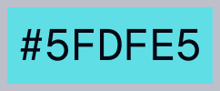   | Maritime Teal    | `l-cyan`    | Light cyan reminiscent of the mist over the sea at high tide, excellent for subtle highlights and UI accents.          |

